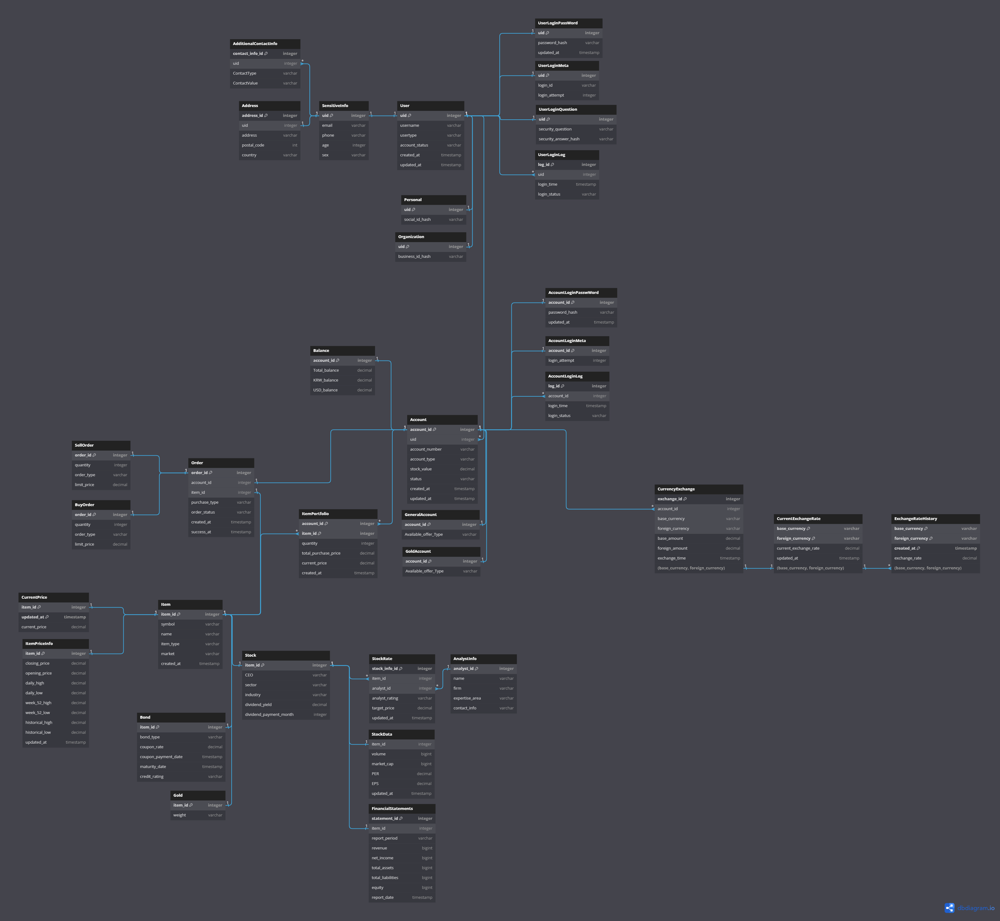

# CAU 2023-2 Database Design
## Team 1 - Stock Trading System
### Members
* **20196014 물리학과 고지흔**
* **20224680 소프트웨어학부 김경민**
* **20224566 소프트웨어학부 김동우**
* **20225779 소프트웨어학부 김제신**
* **20224280 간호학과 윤재훈**
<hr>

## To do
- [ ] 테이블 30개 이상
- [ ] stock_info
- [ ] 입출금

## 함수 명세
- [X] **통화 변환**: 환율에 따라 통화를 변환하는 기능을 수행합니다.
```sql
DELIMITER $$

CREATE FUNCTION ExchangeCurrency(
    p_account_id INT, 
    p_base_currency VARCHAR(3), 
    p_foreign_currency VARCHAR(3), 
    p_foreign_amount DECIMAL(65,7),
    p_exchange_rate DECIMAL(65,7)
) RETURNS BOOLEAN DETERMINISTIC
BEGIN
    DECLARE v_base_balance DECIMAL(65,7);
    DECLARE v_foreign_balance DECIMAL(65,7);
    DECLARE v_required_base_amount DECIMAL(65,7);
    DECLARE v_total_balance DECIMAL(65,7);
    DECLARE v_success BOOLEAN;

    -- 필요한 기본 통화량 계산
    SET v_required_base_amount = p_foreign_amount * p_exchange_rate;

    -- 잔액 확인
    SELECT krw_balance, usd_balance, total_balance INTO v_base_balance, v_foreign_balance, v_total_balance
    FROM Balance
    WHERE account_id = p_account_id;

    -- 잔액 확인 및 환전 처리
    IF (p_base_currency = 'KRW' AND v_base_balance >= v_required_base_amount) OR
       (p_base_currency = 'USD' AND v_foreign_balance >= v_required_base_amount) THEN

        -- Balance 테이블 업데이트
        UPDATE Balance
        SET krw_balance = IF(p_base_currency = 'KRW', v_base_balance - v_required_base_amount, v_base_balance + (p_foreign_amount * p_exchange_rate)),
            usd_balance = IF(p_base_currency = 'USD', v_foreign_balance - v_required_base_amount, v_foreign_balance + (p_foreign_amount / p_exchange_rate));

        -- CurrencyExchange 테이블 업데이트
        INSERT INTO CurrencyExchange (account_id, base_currency, foreign_currency, base_amount, foreign_amount, exchange_time)
        VALUES (p_account_id, p_base_currency, p_foreign_currency, v_required_base_amount, p_foreign_amount, NOW());

        SET v_success = TRUE;
    ELSE
        SET v_success = FALSE;
    END IF;

    RETURN v_success;
END $$

DELIMITER ;
```
- [X] **수익률 계산**: 투자 자산의 수익률을 계산합니다.
```sql
DELIMITER //

CREATE FUNCTION calculate_total_return_in_krw (accountId INT)
    RETURNS DECIMAL(65,7)
    DETERMINISTIC
BEGIN
    DECLARE finished INTEGER DEFAULT 0;
    DECLARE item_id INT;
    DECLARE purchase_price, current_price, quantity DECIMAL(65,7);
    DECLARE total_investment, total_current_value DECIMAL(65,7) DEFAULT 0;
    DECLARE market CHAR(1);
    DECLARE exchange_rate DECIMAL(65,7);
    DECLARE currency CHAR(3);
    DECLARE item_cursor CURSOR FOR
        SELECT sp.item_id, sp.total_purchase_price, sp.quantity, cp.current_price, LEFT(i.market, 1)
        FROM ItemPortfolio sp
                 JOIN CurrentPrice cp ON sp.item_id = cp.item_id
                 JOIN Item i ON sp.item_id = i.item_id
        WHERE sp.account_id = accountId;
    DECLARE CONTINUE HANDLER
        FOR NOT FOUND SET finished = 1;

    -- 현재 환율 가져오기 (USD to KRW), 가장 최신 정보 사용
    SELECT current_exchange_rate INTO exchange_rate
    FROM CurrentExchangeRate
    WHERE base_currency = 'USD' AND foreign_currency = 'KRW'
    ORDER BY updated_at DESC
    LIMIT 1;

    OPEN item_cursor;

    read_loop: LOOP
        FETCH item_cursor INTO item_id, purchase_price, quantity, current_price, market;

        IF finished = 1 THEN
            LEAVE read_loop;
        END IF;

        -- 통화 결정 및 환율 적용
        IF UPPER(market) = 'K' THEN
            SET currency = 'KRW';
        ELSE
            SET currency = 'USD';
            SET current_price = current_price * exchange_rate;
            SET purchase_price = purchase_price * exchange_rate;
        END IF;

        -- 총 투자액과 현재 가치 계산
        SET total_investment = total_investment + (purchase_price * quantity);
        SET total_current_value = total_current_value + (current_price * quantity);
    END LOOP;

    CLOSE item_cursor;

    -- 총 수익률 계산
    IF total_investment > 0 THEN
        RETURN (total_current_value - total_investment) / total_investment * 100;
    ELSE
        RETURN 0;
    END IF;
END //

DELIMITER ;
```
- [X] **주문 유효성 검사**: 주문이 유효한지 검사하는 데 사용됩니다.
```sql
DELIMITER $$

CREATE FUNCTION CheckOrderValidity(input_order_id INT, input_account_id INT)
RETURNS BOOLEAN DETERMINISTIC
BEGIN
    DECLARE itemMarket CHAR(1);
    DECLARE accountBalance DECIMAL(65, 7);
    DECLARE orderAmount DECIMAL(65, 7);
    DECLARE currencyType VARCHAR(3);
    DECLARE purchaseType CHAR(1);

    -- Order의 purchase_type과 Item의 market 정보를 가져옵니다.
    SELECT `Order`.purchase_type, Item.market INTO purchaseType, itemMarket
    FROM `Order` INNER JOIN Item ON `Order`.item_id = Item.item_id
    WHERE `Order`.order_id = input_order_id LIMIT 1;

    -- 화폐 타입 결정
    IF LEFT(itemMarket, 1) = 'k' THEN
        SET currencyType = 'KRW';
    ELSE
        SET currencyType = 'USD';
    END IF;

    -- 계정의 잔액을 가져옵니다.
    SELECT IF(currencyType = 'KRW', krw_balance, usd_balance) INTO accountBalance
    FROM Balance
    WHERE account_id = input_account_id LIMIT 1;

    -- 주문 금액 계산
    IF LEFT(purchaseType, 1) = 'B' THEN
        SELECT quantity * limit_price INTO orderAmount
        FROM `BuyOrder`
        WHERE order_id = input_order_id LIMIT 1;
    ELSE
        SELECT quantity * limit_price INTO orderAmount
        FROM `SellOrder`
        WHERE order_id = input_order_id LIMIT 1;
    END IF;

    -- 잔액과 주문 금액 비교
    RETURN accountBalance >= orderAmount;
END$$

DELIMITER ;
```

## 프로시저 명세
- [X] **ItemPriceInfo 내용 갱신**: ItemPriceInfo 테이블의 내용을 갱신하는데 사용됩니다.
```sql
DELIMITER $$

CREATE TRIGGER ResetAccountLoginAttempts AFTER UPDATE ON AccountLoginPassword
    FOR EACH ROW
BEGIN
    IF NEW.password_hash = OLD.password_hash THEN
        UPDATE AccountLoginMeta SET login_attempt = 0 WHERE account_id = NEW.account_id;
    END IF;
END$$

DELIMITER ;
```
- [X] **stockportfolio 테이블 total_purchase_price 갱신에 사용**: stockportfolio 테이블 내의 total_purchase_price를 갱신하는 데 사용됩니다.
```sql
DELIMITER $$

CREATE PROCEDURE UpdateStockPortfolioTotalPurchasePrice(IN p_account_id INTEGER, IN p_item_id INTEGER, IN p_total_purchase_price DECIMAL(65,7))
BEGIN
    UPDATE ItemPortfolio
    SET total_purchase_price = p_total_purchase_price
    WHERE account_id = p_account_id AND item_id = p_item_id;
END$$

DELIMITER ;
```
- [X] **미체결을 체결로 만들어 주는 프로시저**: 미체결 주문을 체결 상태로 만드는 프로시저입니다.
```sql
DELIMITER $$

CREATE PROCEDURE FinalizeOrder(IN p_order_id INTEGER)
BEGIN
    UPDATE `Order`
    SET order_status = 'success', success_at = NOW()
    WHERE order_id = p_order_id;
END$$

DELIMITER ;
```

## 트리거 명세
- [X] **AccountLogin 횟수 초기화**: AccountLogin의 로그인 시도 횟수를 초기화합니다.
```sql
DELIMITER $$

CREATE TRIGGER ResetAccountLoginAttempts AFTER UPDATE ON AccountLoginPassword
FOR EACH ROW
BEGIN
    IF NEW.password_hash = OLD.password_hash THEN
        UPDATE AccountLoginMeta SET login_attempt = 0 WHERE account_id = NEW.account_id;
    END IF;
END$$

DELIMITER ;
```
- [X] **AccountLogin 횟수 자동 증가**: 로그인 실패 시 AccountLogin의 시도 횟수를 자동으로 증가시킵니다.
```sql
DELIMITER $$

CREATE TRIGGER IncreaseAccountLoginAttempts AFTER INSERT ON AccountLoginLog
FOR EACH ROW
BEGIN
    IF NEW.login_status = 'fail' THEN
        UPDATE AccountLoginMeta SET login_attempt = login_attempt + 1 WHERE account_id = NEW.account_id;
    END IF;
END$$

DELIMITER ;
```
- [X] **UserLogin 횟수 초기화**: UserLogin의 로그인 시도 횟수를 초기화합니다.
```sql
DELIMITER $$

CREATE TRIGGER ResetUserLoginAttempts AFTER UPDATE ON UserLoginPassword
    FOR EACH ROW
BEGIN
    IF NEW.password_hash = OLD.password_hash THEN
        UPDATE UserLoginMeta SET login_attempt = 0 WHERE uid = NEW.uid;
    END IF;
END$$

DELIMITER ;
```
- [X] **UserLogin 횟수 자동증가**: 로그인 실패 시 UserLogin의 시도 횟수를 자동으로 증가시킵니다.
```sql
DELIMITER $$

CREATE TRIGGER IncreaseUserLoginAttempts AFTER INSERT ON UserLoginLog
    FOR EACH ROW
BEGIN
    IF NEW.login_status = 'fail' THEN
        UPDATE UserLoginMeta SET login_attempt = login_attempt + 1 WHERE uid = NEW.uid;
    END IF;
END$$

DELIMITER ;
```

  

5. Nomalization
6. Your program should create more than 10records for all tables
7. Your program should be able to create, read, update and delete records in your DB
8. Front and Back
      - [x] 로그인(/api/login)
         - input
          ```json
              {
                "id": "admin",
                "password_hash": "admin"
               }
          ```
          - output
          ```json
                {
                  "uID" : 1
                  "username": "admin",
                  "accountNumbers": [
                     "120312312-1231231"
                  ]
                  "account_type": [
                     "GeneralAccount"
                  ]
                }
          ```
      - [X] 계좌 로그인(/api/account/login)
          - input
          ```json
            {
                "account_number" : "12300000000",
                "password_hash" : "26795f6e81e330d69174f2cfad2e7f21"
            }
          ```
          - output
          ```json
              {
                "account_id": 1,
                "uid": 1,
                "account_number": "12300000000",
                "account_type": "general",
                "stock_value": 10000.0,
                "status": "active",
                "created_at": "2023-12-12 04:32:35.0",
                "available_offer_Type": "Offer_Type_1"
            }
          ```
      - [X] 종목검색 - 검색어 / itemid, name, market_name, price
   
      - [ ] 주문창 페이지 created - account_id, itemid / balance, 주식 종목 명, current_price, start_price, 현재 나와있는 물량(가격,수량)
      - [X] 주문 창 - itemid, account_id, 시장가 여부, 지정가, 매수 매도 여부, 수량 / 주문 신청 성공여부
      - [X] 주문 창(미채결 주문) - itemid, account_id / 종목명, 매매구분(매수 매도),주문단가, 미채결량,현재가, 원주문번호
      - [X] 주문 창(정정) - itemid, account_id, 정정 가격, 원주문번호/ 정정주문번호, 정정주문 신청 성공여부
      - [X] 주문 창(취소) - itemid, account_id, 원주문번호/ 정정(취소)주문 신청 성공여부
      - [ ] 잔고 조회 - account_id / 현재환율, 잔고에있는 종목들(종목명, 평가손익, 수익률, 보유수량, 평가금액, 비중, 매입단가, 매수금액, 현재가), 예수금, 원화 달러 여부(/api/account) -> 더 추가할예정
         - input
          ```json
          {
            "account_number" : "120312312-1231231"
            "password": "1234"
          }
          ```
         - output(아직 미완성)
          ```json
            {
                "stock_value": 2012030.0, // Account 평가금액
                "KRW_balance": 100001, // balance //예수금
                "name": 삼성전자 // item
                "평가손익": 40000  // (current_price - average_purchase_price) * quantity
                "수익률": 3 // (current_price - average_purchase_price) / average_purchase_price * 100
                "quantity": 3 // stockportfolio 보유수량
                "평가금액": 120000 // current_price * quantity
                "average_purchase_price": 90000 // 매입단가 stockportfolio
                "매수금액": 270000 // average_purchase_price * quantity
                "current_price": 40000 // 현재가 CurrentPrice
            }
          ``` 
      - [X] 환율 기록조회(/api/exchange/rate)
          - input
          ```json
            {
              "base_currency" : "USD",
              "foreign_currency" : "KRW", 
              "created_at" : "2023-12-05"
            }
          ```
          - output
          ```json
              {
                1000.0
            }
          ```
      - [X] 환전(/api/exchange)
            - input
          ```json
          {
            "account_id" : 1
            }
          ```
          - output
          ```json
          {
            "current_exchange_rate": 0.0,
            "krw_Balance": 8000.0,
            "usd_Balance": 2.0
            }
          ```
      - [X] 환전 신청 - account_id, from통화, to 통화, to 통화기준 금액/ 성공여부, 환전후 원화잔고, 달러잔고
      - [X] 기업 정보 - item_id/기업정보
      - [X] 채결 기록 - 날짜(하루), account_id/ stockTradinglog
      - [X] 개인 정보 확인 (수정) - userid/ user, username, email, phone, street_address, city, state, country, ..
        - input
         ```json
         {
            "uid" : 1
           }
      
         ```
        - output
         ```json
         {
             "uid": 1,
             "address": "123 Main St",
             "postal_code": 12345,
             "country": "Korea",
             "email": "john@example.com",
             "phone": "010-1234-5679",
             "age": 30,
             "sex": "Male",
             "contactValue": "john.secondary@example.com",
             "contactType": "secondary_email"
         }
         ```
9. Front
      - [x] 주문 정정창에 등락 없애기, 취소 누르기, 정정에서 수량 칸 구매가능 주수 없애기
      - [x] 로그인 후 창에 계좌 선택 넣고 계좌를 선택해야 주문하기, 잔고확인 버튼 생기게
      - [x] vuex에 account 정보, 현재 선택된 account
      - [x] 종목 검색페이지 갈때 request parameter로 계좌 타입도 - 그냥 vuex state로 처리
      - [ ] 주문 신청 성공 여부 창
      - [ ] 정정신청 시 기존 주문 지우고 새주문 띄우기
      - [x] 잔고에서 전일가 지우고 표 열 맞추기
      - [x] 잔고에서 D+2빼고 달러 원화나눠서 표시
      - [ ] 환율확인 -> 환전 / from to 통화/ 얼마할꺼냐 / from테이블 기준으로 얼마 환전 가능한지
      - [x] 잔고확인 창 박으로 빼기
      - [ ] 환율 조회 기간-최대한달. end date 현재날짜 까지.
      - [x] 계좌 비밀번호 창
      - [x] 기업 정보 - 주문 창에서 넘어갈수 있는 페이지
      - [x] 채결 기록 잔고확인 전환 버튼 
<hr>

## Table-Diagram


<br>
<hr>
<br>

# Stock DataBase 물리 명세서

이 문서는 사용자, 개인 및 기업 상세 정보, 로그인 정보, 계좌, 주문 및 주식 관련 정보 등 다양한 엔터티를 처리하기 위한 주식 데이터베이스의 물리적 명세를 개요합니다.

### User
- **사용자 관련 정보를 담은 테이블**
- 필드:
  - `uid`: integer (PK, Auto-increment) - 인공키
  - `username`: varchar - 사용자명
  - `usertype`: varchar - 사용자 타입
  - `account_status`: varchar - 계정 상태
  - `created_at`: timestamp - 레코드 생성일
  - `updated_at`: timestamp - 레코드 갱신일

### Personal
- **개인 사용자 정보를 담은 테이블**
- 필드:
  - `uid`: integer (PK, FK: User.uid) - 인공키
  - `social_id_hash`: varchar - 암호화된 주민등록번호

### Organization
- **기업 사용자 정보를 담은 테이블**
- 필드:
  - `uid`: integer (PK, FK: User.uid) - 인공키
  - `business_id_hash`: varchar - 암호화된 회사 고유 번호

# 데이터베이스 테이블 명세

### UserLoginPassWord
- **사용자 계정 로그인을 위한 비밀번호 테이블**
- 필드:
  - `uid`: integer (PK, FK: User.uid) - 인공키
  - `password_hash`: varchar - 암호화된 비밀번호, 특수문자 "!","@","#","$"만 허용
  - `updated_at`: timestamp - 레코드 갱신일

### UserLoginMeta
- **계정 로그인 시도 횟수 테이블**
- 필드:
  - `login_id`: varchar - 로그인 시 사용하는 아이디, 특수문자 제한
  - `login_attempt`: integer - 로그인 시도 횟수, 성공시 초기화

### UserLoginQuestion
- **계정 로그인하기 위한 비밀번호 찾기 질문 테이블**
- 필드:
  - `security_question`: varchar - 보안 질문
  - `security_answer_hash`: varchar - 암호화된 보안 질문 답

### UserLoginLog
- **로그인 로그를 기록하기 위한 테이블**
- 필드:
  - `log_id`: integer (PK, Auto-increment) - 인공키
  - `uid`: integer (FK: User.uid) - 인공키
  - `login_time`: timestamp - 로그인 시도 시간
  - `login_status`: varchar - 로그인 성공/실패 여부

### SensitiveInfo
- **사용자의 민감한 정보를 담은 테이블**
- 필드:
  - `uid`: integer (PK, FK: User.uid) - 인공키
  - `email`: varchar - 이메일
  - `phone`: varchar - 전화번호
  - `age`: integer - 나이 (기업일 경우 -1)
  - `sex`: varchar - 성별

### AdditionalContactInfo
- **사용자의 추가 연락처 정보를 담은 테이블**
- 필드:
  - `contact_info_id`: integer (PK, Auto-increment) - 인공키
  - `uid`: integer (FK: SensitiveInfo.uid) - 인공키
  - `contact_type`: varchar - 추가 연락처 타입
  - `contact_value`: varchar - 추가 연락처 값

### Address
- **사용자 주소 정보를 담은 테이블**
- 필드:
  - `address_id`: integer (PK, Auto-increment) - 인공키
  - `uid`: integer (FK: SensitiveInfo.uid) - 인공키
  - `address`: varchar - 주소
  - `postal_code`: integer - 우편번호
  - `country`: varchar - 국가

### Account
- **계좌 정보를 담은 테이블**
- 필드:
  - `account_id`: integer (PK, Auto-increment) - 인공키
  - `uid`: integer (FK: User.uid) - 인공키
  - `account_number`: varchar - 계좌번호
  - `account_type`: varchar - 계좌 타입
  - `stock_value`: decimal - 주식, 채권, 금 자산 가치
  - `status`: varchar - 계좌 활성화 상태
  - `created_at`: timestamp - 계좌 생성 시간
  - `updated_at`: timestamp - 상태 갱신 시간

### AccountLoginPasswWord
- **계정 로그인 후 계좌에 로그인하기 위한 테이블**
- 필드:
  - `account_id`: integer (PK, FK: Account.account_id) - 인공키
  - `password_hash`: varchar - 암호화된 계좌 비밀번호, 비밀번호 숫자 4자리로 고정
  - `updated_at`: timestamp - 비밀번호 최종 수정 날짜

### AccountLoginMeta
- **계좌 로그인 시도 횟수를 저장하는 테이블**
- 필드:
  - `password_attempt`: integer - 계좌 비밀번호 시도 횟수

### AccountLoginLog
- **계좌에 로그인한 기록을 담은 테이블**
- 필드:
  - `log_id`: integer (PK, Auto-increment) - 인공키
  - `account_id`: integer (FK: Account.account_id) - 인공키
  - `login_time`: timestamp - 로그인 시도 시간
  - `login_status`: varchar - 로그인 성공 실패 여부 ("success", "fail")

### Balance
- **계좌의 잔액 정보를 저장하는 테이블**
- 필드:
  - `account_id`: integer (PK, FK: Account.account_id) - 인공키
  - `total_balance`: decimal - 총액 (KRW + USD 환율 적용)
  - `krw_balance`: decimal - 원화 소유액
  - `usd_balance`: decimal - 달러 소유액

### GeneralAccount
- **일반 계좌 정보를 저장하는 테이블**
- 필드:
  - `account_id`: integer (PK, FK: Account.account_id) - 인공키
  - `Available_offer_Type`: varchar - 주문 가능 타입

### GoldAccount
- **금 계좌 정보를 저장하는 테이블**
- 필드:
  - `account_id`: integer (PK, FK: Account.account_id) - 인공키
  - `Available_offer_Type`: varchar - 주문 가능 타입

### ItemPortfolio
- **주식 포트폴리오 정보를 저장하는 테이블**
- 필드:
  - `account_id`: integer (PK, FK: Account.account_id) - 인공키
  - `item_id`: integer (PK, FK: Item.item_id) - 인공키
  - `quantity`: integer - 보유 수량
  - `total_purchase_price`: decimal - 평균 구매 가격
  - `current_price`: decimal - 현재 주식 가격
  - `created_at`: timestamp - 주식 구매 날짜

### Order
- **주문 정보를 저장하는 테이블**
- 필드:
  - `order_id`: integer (PK, Auto-increment) - 인공키
  - `account_id`: integer (FK: Account.account_id) - 인공키
  - `item_id`: integer (FK: Item.item_id) - 인공키
  - `purchase_type`: varchar - 매수/매도 타입
  - `order_status`: varchar - 주문 상태
  - `created_at`: timestamp - 주문 생성 시간
  - `success_at`: timestamp - 거래 시간

### BuyOrder
- **구매 주문 정보를 저장하는 테이블**
- 필드:
  - `order_id`: integer (PK, FK: Order.order_id) - 인공키
  - `quantity`: integer - 주문 수량
  - `order_type`: varchar - 시장가/지정가 타입
  - `limit_price`: decimal - 지정 가격 (order_type이 'limit'일 때만 적용)

### SellOrder
- **판매 주문 정보를 저장하는 테이블**
- 필드:
  - `order_id`: integer (PK, FK: Order.order_id) - 인공키
  - `quantity`: integer - 판매 수량
  - `order_type`: varchar - 시장가/지정가 타입
  - `limit_price`: decimal - 지정 가격 (order_type이 'limit'일 때만 적용)

### CurrencyExchange
- **통화 교환 정보를 저장하는 테이블**
- 필드:
  - `exchange_id`: integer (PK, Auto-increment) - 인공키
  - `account_id`: integer (FK: Account.account_id) - 인공키
  - `base_currency`: varchar - 기준 통화
  - `foreign_currency`: varchar - 바꿀 통화
  - `base_amount`: decimal - 기준 통화량
  - `foreign_amount`: decimal - 외화 통화량
  - `exchange_time`: timestamp - 교환 시간

### CurrentExchangeRate
- **현재 환율 정보를 저장하는 테이블**
- 필드:
  - `base_currency`: varchar (PK, FK: CurrencyExchange.base_currency) - 기준 통화
  - `foreign_currency`: varchar (PK, FK: CurrencyExchange.foreign_currency) - 바꿀 통화
  - `current_exchange_rate`: decimal - 현재 환율
  - `updated_at`: timestamp - 갱신 시간

### ExchangeRateHistory
- **역대 환율 정보를 계속 저장하는 테이블**
- 필드:
  - `base_currency`: varchar (PK, FK: CurrencyExchange.base_currency) - 기준 통화
  - `foreign_currency`: varchar (PK, FK: CurrencyExchange.foreign_currency) - 바꿀 통화
  - `created_at`: timestamp (PK) - 갱신 시간
  - `exchange_rate`: decimal - 환율

### Item
- **주식, 금 등의 정보를 저장하는 테이블**
- 필드:
  - `item_id`: integer (PK, Auto-increment) - 인공키
  - `symbol`: varchar - 심볼, 티커
  - `name`: varchar - 아이템 이름
  - `item_type`: varchar - 아이템 타입 (주식, 금, 채권)
  - `market`: varchar - 속한 마켓
  - `created_at`: timestamp - 생성 시간

### ItemPriceInfo
- **역대 아이템의 가격 정보를 저장하는 테이블**
- 필드:
  - `item_id`: integer (PK, FK: Item.item_id) - 인공키
  - `closing_price`: decimal - 전일 종가
  - `opening_price`: decimal - 당일 시가
  - `daily_high`: decimal - 당일 최고가
  - `daily_low`: decimal - 당일 최저가
  - `week_52_high`: decimal - 52주 최고가
  - `week_52_low`: decimal - 52주 최저가
  - `historical_high`: decimal - 역대 최고가
  - `historical_low`: decimal - 역대 최저가
  - `updated_at`: timestamp - 갱신 시간

### CurrentPrice
- **현재 시장 가격 정보를 저장하는 테이블**
- 필드:
  - `item_id`: integer (PK, FK: Item.item_id) - 인공키
  - `updated_at`: timestamp (PK) - 갱신 시간
  - `current_price`: decimal - 현재 주식 가격

### Stock
- **주식 정보를 저장하는 테이블**
- 필드:
  - `item_id`: integer (PK, FK: Item.item_id) - 인공키
  - `CEO`: varchar - CEO 이름
  - `sector`: varchar - 섹터
  - `industry`: varchar - 산업군
  - `dividend_yield`: decimal - 배당율
  - `dividend_payment_month`: integer - 배당이 이루어질 월

### StockData
- **주식 지표를 저장하는 테이블**
- 필드:
  - `item_id`: integer (PK, FK: Stock.item_id) - 인공키
  - `volume`: bigint - 거래량
  - `market_cap`: bigint - 시가총액
  - `PER`: decimal - PER
  - `EPS`: decimal - EPS
  - `updated_at`: timestamp - 갱신 시간

### FinancialStatements
- **주식의 재무제표 관련 정보를 저장하는 테이블**
- 필드:
  - `statement_id`: integer (PK, Auto-increment) - 인공키
  - `item_id`: integer (PK, FK: Stock.item_id) - 인공키
  - `report_period`: varchar - 재무제표의 기간
  - `revenue`: bigint - 회사의 총 매출액
  - `net_income`: bigint - 회사의 순이익
  - `total_assets`: bigint - 회사의 총자산
  - `total_liabilities`: bigint - 회사의 총부채
  - `equity`: bigint - 회사의 자본 (총자산 - 총부채)
  - `report_date`: timestamp - 재무제표 보고 날짜

### StockRate
- **애널리스트가 평가한 정보를 저장하는 테이블**
- 필드:
  - `stock_info_id`: integer (PK, Auto-increment) - 인공키
  - `item_id`: integer (FK: Stock.item_id) - 인공키
  - `analyst_id`: integer (FK: Analyst.analyst_id) - 인공키
  - `analyst_rating`: varchar - 애널리스트 목표 등급
  - `target_price`: decimal - 애널리스트 목표 주가
  - `updated_at`: timestamp - 갱신 시간

### AnalystInfo
- **애널리스트의 정보를 저장하는 테이블**
- 필드:
  - `analyst_id`: integer (PK, Auto-increment) - 인공키
  - `name`: varchar - 애널리스트의 이름
  - `firm`: varchar - 애널리스트가 속한 회사
  - `expertise_area`: varchar - 전문 분야
  - `contact_info`: varchar - 연락처 정보

### Bond
- **채권 정보를 저장하는 테이블**
- 필드:
  - `item_id`: integer (PK, FK: Item.item_id) - 인공키
  - `bond_type`: varchar - 채권 타입
  - `coupon_rate`: decimal - 채권 쿠폰 금리
  - `coupon_payment_date`: timestamp - 쿠폰 지급일
  - `maturity_date`: timestamp - 만기일
  - `credit_rating`: varchar - 채권 신용등급

### Gold
- **금에 관한 정보를 저장하는 테이블**
- 필드:
  - `item_id`: integer (PK, FK: Item.item_id) - 인공키
  - `weight`: varchar - 금 무게

## 키 설명
- `PK`: 기본 키
- `FK`: 외래 키
- `Auto-increment`: 자동 증가 필드

<br>
<hr>

# Stock DataBase 기능 명세서

이 섹션은 주식 거래 시스템의 주요 기능과 제약사항에 대해 설명합니다.

## 유저 영역

- 유저는 자신의 계정을 만들고 로그인할 수 있습니다.
- 유저는 자신의 계정 정보를 열람하고 수정할 수 있습니다.
- 비밀번호를 잊어버린 경우, 보안 질문과 답변을 통해 비밀번호를 찾을 수 있습니다.
- 보안을 위해 10번 이상 로그인 실패 시 계정이 비활성화됩니다.

## 계좌 영역

- 유저는 하나 이상의 계좌를 보유할 수 있으며, 계좌의 정보와 거래에 접근하기 위해서는 계좌 비밀번호가 필요합니다.
- 계좌도 10번 이상의 로그인 실패 시 비활성화됩니다.
- 유저는 금 또는 일반 금융 계좌를 보유할 수 있으며, 각각의 거래 가능 품목이 다릅니다.
- 계좌는 원화와 달러를 모두 저장할 수 있습니다.
- 계좌마다 현재 보유 중인 주식, 이익 및 총 주식 평가금액을 조회할 수 있습니다.

## 환전 영역

- 유저는 원화를 다른 국가의 화폐로 변경하거나 반대로 바꿀 수 있습니다. (현재는 원화와 달러만 가능)
- 유저는 환율 기록을 확인하여 환전을 결정할 수 있습니다.

## 거래 영역

- 유저는 각 종목의 상품 정보를 확인할 수 있습니다.
- 유저는 주식 검색을 통해 각 종목의 평가 정보를 확인할 수 있습니다.
- 각 계좌에서 상품을 주문할 수 있으며, 주문은 일정 시간 후에 자동으로 체결됩니다.
- 거래 체결 전에는 거래를 정정하거나 취소할 수 있습니다.
- 유저는 계좌별 거래 기록을 조회할 수 있습니다.

## 제약사항

- 거래 가능 화폐는 원화와 달러로 제한됩니다.
- 환율과 금융상품의 가격은 하루에 한 번만 갱신됩니다.
- 거래의 체결은 30초 후에 자동으로 이루어집니다.
- 애널리스트 평점은 A, B, C, D, F로 고정됩니다.
- 계좌번호는 11자리, 비밀번호는 숫자 4자리로 고정됩니다.
- 계정 및 계좌의 잠금을 해제하는 방법은 없으며, 계좌 비밀번호를 찾을 수 있는 방법도 없습니다.

